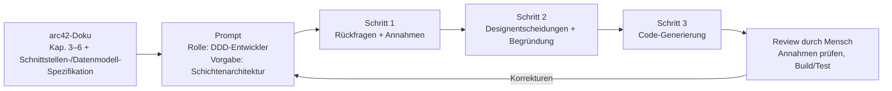

# Food Truck PoS System

## Software Architecture Documentation (arc42)

**Group:** Group 1–2  

**Members:**
- Hoang Linh Pham
- Dilan Ucan
- Quang Khai Le
- Delilah Richter

**Version:** 2.0

---

# 1. Einführung und Ziele

## 1.1 Aufgabenstellung

Das Food Truck PoS System ist eine mobile Kassenlösung für den Betrieb mehrerer Food Trucks. Es ermöglicht Verkäufer:innen, Produkte zu erfassen, Zahlungen abzuwickeln und Belege auszustellen, auch ohne Internetverbindung. Eine zentrale Verwaltungseinheit erlaubt es Marketing und Betrieb, Rabattaktionen zu pflegen, Bestände zu verwalten und Verkaufsdaten auszuwerten.

Zusätzlich muss das System gesetzliche Anforderungen in Deutschland erfüllen. Dazu wird eine Technische Sicherheitseinrichtung (TSE) integriert. Die TSE dient als Sicherheitsmechanismus zur manipulationssicheren Speicherung und Signierung von Kassenvorgängen. Dadurch werden alle Transaktionen revisionssicher dokumentiert und gesetzeskonform gespeichert.

**Wesentliche Use Cases:**

**UC1 Verkauf am Food Truck durchführen:**
Verkäufer:in wählt Produkte aus, das System berechnet Preise und Rabatte automatisch. Der Kunde wählt eine Zahlungsmethode, der Payment Provider bestätigt. Der Vorgang wird mit Zeitstempel, Ort, Truck-ID und Artikeln gespeichert, TSE-konform signiert und ein Bon wird ausgegeben. Verkaufsdaten werden anschließend an die Zentrale synchronisiert.

**UC2 Rabattaktion zentral erstellen und verteilen:**
Marketing erstellt eine Aktion (z. B. „3 für 2"), das System prüft die Regel auf Gültigkeit, speichert und verteilt die Aktion zeitnah an alle betroffenen Trucks. Das PoS wendet die Aktion beim Verkauf automatisch an.

**UC3 – Rabattberechnung am PoS durchführen:**
**Kurzbeschreibung:** Die PoS App berechnet den Endpreis eines Warenkorbs unter Berücksichtigung aller aktiven Rabattaktionen, zeigt die Ersparnis an und gibt die Daten für den Bon weiter.

**Akteure:** KassiererIn, (indirekt: Marketing)

**Vorbedingungen:**
- PoS App ist gestartet und betriebsbereit
- Mindestens ein Artikel ist im Warenkorb
- Aktionsdefinitionen sind im lokalen Cache vorhanden (auch wenn Cache leer: Berechnung ohne Rabatte, kein Fehler)

**Hauptablauf:**
1. Kassierer:in hat Artikel im Warenkorb erfasst
2. Kassierer:in drückt „Bezahlen" oder die Berechnung wird automatisch bei jedem Artikelhinzufügen ausgelöst
3. PoS App sendet Warenkorb (Artikel, Mengen, Preise, Truck-ID, Zeitstempel) an die lokale Promotion Engine
4. Promotion Engine gruppiert Artikel und gleicht sie mit aktiven Aktionen ab
5. Für jede anwendbare Aktion wird der Rabatt berechnet (Prioritätsreihenfolge, Kombinierbarkeitsregeln)
6. Ergebnis mit Endpreis, Aufschlüsselung und Bon-Texten wird an die PoS App zurückgegeben
7. PoS App zeigt dem Kassierer den Endpreis und die Ersparnis an
8. Nach Zahlung werden die Bon-Texte auf den Beleg gedruckt

**Alternativabläufe:**
- 4a: Keine Aktion ist anwendbar -> Endpreis = Originalpreis, leere `appliedPromotions`-Liste
- 4b: Promotion Cache ist leer (z. B. Erstinbetriebnahme ohne Sync) -> Berechnung ohne Rabatte, Warnung im Log

**Nachbedingungen:**
- Endpreis ist berechnet und angezeigt
- Alle angewendeten Aktionen sind dokumentiert
- Bon-Texte sind für den Druck bereit

**UC2: „Bestandsänderung verarbeiten“**

Kurzbeschreibung: Dieser Use Case beschreibt den Ablauf von der Erfassung der verbrauchten Waren am Food-Truck bis hin zur Beauftragung von Nachschub durch ein externes Tourenplanungssystem. 

**Akteure: **

PoS-System (Kasse im Food-Truck): Sendet die Verbrauchsdaten. 

Backend-System (Unser System): Verarbeitet die Daten und trifft Entscheidungen. 

Tourenplanungssystem (Extern): Nimmt Transportaufträge entgegen. 

 

**Fachlicher Ablauf (Standard-Szenario):** 

Trigger: Bei jedem Verkauf (oder alternativ alle 15 Minuten) meldet das PoS-System des Trucks den aktuellen Bestand der verbrauchten Zutaten an das Backend (z. B. -1 Burger-Bun, -1 Patty). 

Prüfung: Das Backend empfängt die Meldung und aktualisiert den virtuellen Lagerbestand des jeweiligen Trucks. 

Schwellenwert-Kontrolle: Das Backend vergleicht den neuen Bestand mit dem festgelegten Meldebestand (Minimum) der jeweiligen Zutat. 

Bedarfsermittlung: Unterschreitet eine Zutat den Meldebestand, berechnet das Backend die benötigte Nachschubmenge (Ziel: Auffüllen bis zum Maximalbestand des Trucks). 

Auftragserstellung: Das Backend bündelt alle aktuell benötigten Zutaten für diesen Truck und generiert einen Transportauftrag. 

Externe Beauftragung: Der Transportauftrag (inklusive Truck-Standort, benötigter Waren und Zeitfenster) wird an das externe Tourenplanungssystem übergeben, welches die Route für den Lieferwagen berechnet. 

 

**Annahmen:** 

Zentrallager: Es gibt ein zentrales Lager in der Stadt, aus dem die Lieferwagen (Sprinter) starten. Dieses Zentrallager hat immer ausreichend Ware vorrätig. 

Zutaten-Level: Der Bestand wird nicht in fertigen Gerichten gemessen (nicht "10 Burger übrig"), sondern auf Zutatenebene (Brötchen, Fleisch, Salat, Soße), da diese in verschiedenen Gerichten verwendet werden können. 

Artikel: Jeder Artikel besitzt einen definierten Mindestbestand und Jeder Artikel wird eindeutig über eine Artikelnummer identifiziert. 

Standorte: Die Food-Trucks haben feste Standplätze für den Tag. Ein Truck bewegt sich nicht, während er auf eine Nachschublieferung wartet. 

Keine Offlinefähigkeit der PoS-Systeme 

Gemäß der Systemanforderungen müssen die Kassensysteme (PoS) in den Trucks keine Offlinefähigkeit unterstützen.  

Begründung und Auswirkung auf die Fachlichkeit: Wir gehen davon aus, dass unsere Food-Trucks ausschließlich in städtischen oder gut angebundenen Gebieten (z. B. auf Festivals) mit lückenloser 4G/5G-Netzabdeckung betrieben werden. Jeder Verkauf wird sofort (in Echtzeit) an das Backend gesendet. Dadurch entfallen komplexe Synchronisationsprozesse.

**Fachliche Regeln (Business Rules) **

 *Regel 1: Sperrfrist / Kein Doppel-Nachschub* 
Für denselben Bedarf darf kein doppelter Transportauftrag erstellt werden, bis die laufende Lieferung als "abgeschlossen" gemeldet wurde. 
*Regel 2 Sammelbestellungen* 
Unterschreitet eine Zutat den Meldebestand, wartet das System für 5 Minuten, ob noch weitere Zutaten dieses Trucks in den kritischen Bereich fallen. So wird vermieden, dass für jedes fehlende Salatblatt ein eigener Lieferauftrag erstellt wird. 
*Regel 3 Lieferpriorität* 
Transportaufträge müssen mit einer Dringlichkeitsstufe an das Tourenplanungssystem übergeben werden. Fällt der Bestand einer Hauptzutat (z. B. Burger-Patties) auf 0, erhält der Auftrag die höchste Priorität (Notfall-Lieferung). 
*Regel 4  Bestandsänderungen*
Bestandsänderungen müssen einem Truck zugeordnet sein 


---

## 1.2 Funktionale Anforderungen

### Verkauf und Kasse (PoS)

| ID | Anforderung |
|---|---|
| F1 | Artikel können am PoS erfasst werden (Touchscreen oder Scanner). |
| F2 | Das System berechnet automatisch den Endpreis unter Berücksichtigung aktiver Rabattaktionen. |
| F2a | Die Rabattberechnung muss eine vollständige Aufschlüsselung aller angewendeten Aktionen zurückgeben, nicht nur den Endpreis |
| F2b | Für jede angewendete Aktion wird ein menschenlesbarer Bon-Text (savingsMessage) generiert |
| F3 | Verkäufe werden mit Zeitstempel, Ort, Truck-ID und Verkäufer:in gespeichert. |
| F4 | Jeder Verkauf wird TSE-konform signiert. |
| F5 | Belege werden ausgegeben. |
| F6 | Stornos sind möglich. |
| F7 | Verkäufe können auch offline durchgeführt werden. |

---

### Zahlung

| ID | Anforderung |
|---|---|
| F8 | Unterstützung mehrerer Zahlungsarten: EC, Kreditkarte, Apple Pay, Google Pay, PayPal, Bar. |
| F9 | Neue Zahlungsarten können ohne Architekturänderung integriert werden. |

---

### Rabatte und Aktionen

| ID | Anforderung |
|---|---|
| F10 | Rabattaktionen können zentral gepflegt werden. |
| F11 | Unterstützung verschiedener Aktionstypen wie Mengenrabatt, Bundle-Preis, prozentualer Rabatt und Happy Hour. |
| F11a | Es muss definiert sein, in welcher Reihenfolge mehrere Aktionen auf denselben Warenkorb angewendet werden (Prioritätsregel) |
| F12 | Aktualisierungen werden zeitnah an alle Trucks verteilt. |

---

### Bestand und Nachschub

| ID | Anforderung |
|---|---|
| F13 | Bestandsänderungen pro Truck werden erfasst. |
| F14 | Das System löst automatisch Nachschub aus der Zentrale aus. |
| F15 | Zentralbestand wird geführt und Nachbestellungen erfolgen automatisch. |
| F16 | Lieferanten-Schnittstellen können über Adapter integriert werden. |

---

### Schnittstellen

| ID | Anforderung |
|---|---|
| F17 | Export von Verkäufen und Rechnungen an bestehende Buchhaltungssysteme. |
| F18 | Integration sozialer Medien für Standort- und Verfügbarkeitsinformationen. |

---

### Verwaltung und Auswertung

| ID | Anforderung |
|---|---|
| F19 | Zentrales Dashboard zur Auswertung von Verkäufen. |

---

## 1.3 Nichtfunktionale Anforderungen (Qualitätsmerkmale)

### Reliability & Availability

| ID | Anforderung |
|---|---|
| NF1 | Verkäufe können bei Verbindungsabbruch lokal gespeichert und später synchronisiert werden. |
| NF2 | Kein Datenverlust bei Verbindungsabbruch. |

---

### Performance Efficiency

| ID | Anforderung |
|---|---|
| NF3 | Das PoS läuft flüssig auf leistungsschwacher Hardware. |
| NF4 | Preisberechnung und Rabattprüfung erfolgen in unter x Millisekunden. |
| NF4a | Die Rabattberechnung muss in unter 50 ms abgeschlossen sein (für max. 20 Positionen, 10 aktive Aktionen) |
| NF5 | Rabattaktionen werden innerhalb weniger Minuten verteilt. |

---

### Security

| ID | Anforderung |
|---|---|
| NF6 | TSE-konforme und unveränderliche Speicherung aller Verkäufe. |
| NF7 | Datenschutz bei Kundendaten und Social-Media-Integration. |

---

### Maintainability

| ID | Anforderung |
|---|---|
| NF8 | Neue Aktionstypen können ohne manuelle Truck-Updates eingeführt werden. |
| NF9 | Die Architektur unterstützt Weiterentwicklung über mindestens drei Jahre. |

---

### Compatibility

| ID | Anforderung |
|---|---|
| NF10 | Offene Schnittstellen zur Buchhaltung. |

---

### Usability

| ID | Anforderung |
|---|---|
| NF11 | Ein Verkaufsvorgang soll mit weniger als fünf Bedienungsaktionen möglich sein. |
| NF12 | Das System soll schnell einsatzfähig sein. |
| NF13 | Die Rabattberechnung muss deterministisch sein: identische Eingaben führen immer zum identischen Ergebnis |

---

## 1.4 Qualitätsziele

| Priorität | Qualitätsmerkmal                    | Szenario                                                                                                                            |
| --------- | ----------------------------------- | ----------------------------------------------------------------------------------------------------------------------------------- |
| 1         | **Reliability / Offline-Fähigkeit** | Verkäufe inkl. TSE-Signatur funktionieren vollständig ohne Netzverbindung; kein Datenverlust bei Verbindungsabbruch (NF1, NF2)      |
| 2         | **Sicherheit / Compliance**         | Jeder Kassiervorgang wird TSE-konform unveränderlich signiert (NF6); Kundendaten werden datenschutzkonform behandelt (NF7)          |
| 3         | **Usability**                       | Ein Artikel kann in unter 5 Bedienungsschritten verkauft werden (NF11); das PoS läuft flüssig auf leistungsschwacher Hardware (NF3) |
| 4         | **Wartbarkeit / Erweiterbarkeit**   | Neue Aktionstypen sind ohne manuellen Update am Truck einführbar; die Architektur trägt mindestens 3 Jahre (NF8, NF9)               |
| 5         | **Performance**                     | Preisberechnung inkl. Rabattprüfung am PoS in unter x ms; Aktionsupdates erreichen alle Online-Trucks in unter x Minuten (NF4, NF5) |

## 1.5 Stakeholder

| Rolle                     | Erwartungshaltung                                                        |
| ------------------------- | ------------------------------------------------------------------------ |
| Verkäufer:in (Food Truck) | Schnelle, einfache Bedienung; Offline-Betrieb; zuverlässige Belegausgabe |
| Marketing / Zentrale      | Einfache Pflege von Rabattaktionen; schnelle Verteilung an Trucks        |
| Buchhaltung               | Vollständiger, korrekter Export aller Verkaufsdaten                      |
| IT / Entwicklung          | Modulare, wartbare Architektur; offene Schnittstellen                    |
| Gesetzgeber / Finanzamt   | TSE-konforme Aufzeichnung aller Kassenvorgänge                           |
| Kunden                    | Breites Zahlungsangebot; schnelle Abwicklung                             |
| Lieferanten               | Standardisierte oder adapter-basierte Bestellschnittstelle               |

---

## 1.6 Offene Fragen

### Architektur-relevante Fragen

- Welche sozialen Medien sollen unterstützt werden?
- Welche konkreten Zahlungsarten werden benötigt?
- Wird Hardware-TSE oder Cloud-TSE verwendet?
- Welches Buchhaltungssystem wird genutzt?
- Wie viele Trucks sollen in Zukunft unterstützt werden?
- Welche Geräte sind aktuell im Einsatz?
- Wie schnell müssen Rabattaktionen verteilt werden?
- Soll eine Expansion außerhalb Deutschlands unterstützt werden?

---

### Weitere Fragen

- Soll Trinkgeld unterstützt werden?
- Digitale oder gedruckte Belege?
- Wie viele Rabattaktionen können gleichzeitig aktiv sein?
- Sollen stationäre Standorte ebenfalls unterstützt werden?

---

## 1.7 Anforderungen, die kritisch bewertet werden

| Anforderung | Begründung |
|---|---|
| Vollautomatische Nachbestellung | Hoher Integrationsaufwand durch unterschiedliche Lieferanten-Schnittstellen |
| Eigenes TSE-System entwickeln | Sehr hoher rechtlicher und technischer Aufwand |
| Eigenes Payment-System entwickeln | Hohe Sicherheits- und Zertifizierungsanforderungen |
| PayPal als Pflicht-Zahlungsart | Zusätzliche Integrations- und Gebührenkosten |

# 2. Randbedingungen

| Typ             | Randbedingung               | Erläuterung                                                               |
| --------------- | --------------------------- | ------------------------------------------------------------------------- |
| Technisch       | Offline-Betrieb Pflicht     | Food Trucks haben instabile oder fehlende Internetverbindung              |
| Technisch       | TSE-Pflicht (gesetzlich)    | Jeder Kassiervorgang muss unveränderlich signiert werden (KassenSichV)    |
| Technisch       | Leistungsschwache Hardware  | Das PoS muss auf Tablets und einfachen PoS-Geräten laufen                 |
| Technisch       | Cloud-TSE                   | Anbindung an die Cloud-TSE Schnittstelle                                  |
| Organisatorisch | Bestehende Buchhaltung      | Schnittstelle zur vorhandenen Buchhaltungssoftware muss integriert werden |
| Organisatorisch | Betriebsdauer mind. 3 Jahre | Architektur muss langfristige Erweiterbarkeit sicherstellen               |
| Rechtlich       | Datenschutz                 | Insbesondere bei Social-Media-Integration (DSGVO)                         |
| Offen           | Konkrete Zielgeräte         | Noch nicht final festgelegt (siehe offene Fragen)                         |

---

# 3. Kontextabgrenzung

Die Kontextabgrenzung beschreibt, welche Bestandteile zum PoS-System gehören und welche externen Systeme außerhalb der eigentlichen Systemgrenze liegen. Ziel ist es, die wichtigsten Akteure, Nachbarsysteme und Schnittstellen sichtbar zu machen.

Das System kommuniziert mit verschiedenen externen Systemen wie Zahlungsanbietern, Lieferanten, dem Buchhaltungssystem, der TSE sowie sozialen Medien. Diese Systeme sind nicht Teil der eigenen Architektur, beeinflussen jedoch die Anforderungen und die technische Gestaltung des Gesamtsystems wesentlich.

Durch die Kontextabgrenzung wird außerdem deutlich, welche Daten und Informationen zwischen dem System und den externen Akteuren ausgetauscht werden. Dadurch können Verantwortlichkeiten, Abhängigkeiten und Integrationspunkte frühzeitig erkannt und dokumentiert werden.


| Nachbar-/Externes System | Erklärung |
|---|---|
| Supplier System | Das Lieferantensystem stellt Waren und Zutaten für die Food Trucks bereit. |
| Accounting System | Das Buchhaltungssystem verarbeitet Verkaufsdaten und steuerrelevante Informationen. |
| Payment Provider | Der Payment Provider verarbeitet digitale Zahlungen wie EC-Karte, Kreditkarte oder Apple Pay. |
| Cloud TSE Service | Der Cloud TSE Service signiert Kassenvorgänge gemäß gesetzlicher Anforderungen. |
| Social Media APIs | Social Media APIs ermöglichen die Veröffentlichung von Aktionen und Standortinformationen. |

# 4. Bausteinsicht 

Die Bausteinsicht beschreibt die statische Struktur des Food-Truck-PoS-Systems.  
Das System ist in mehrere logisch getrennte Services und Komponenten aufgeteilt, um Skalierbarkeit, Wartbarkeit und Offline-Fähigkeit zu ermöglichen.

Das System besteht aus:

- lokalen Komponenten im Food Truck
- zentralen Backend-Services
- externen Drittanbieter-Systemen

Die wichtigsten Bausteine sind:

- PoS App
- Offline Sync Service
- Local Inventory Cache
- Order Service
- Payment Service
- Promotion Service
- Inventory Service
- Accounting Export Service
- Procurement Service
- Marketing Service
- Reporting Service

---

## 4.1 Whitebox Gesamtsystem

### Übersichtsdiagramm


---

### Enthaltene Bausteine

| Name | Verantwortung |
|---|---|
| PoS App | Benutzeroberfläche für Kassierer |
| Offline Sync Service | Synchronisierung lokaler Daten mit Backend |
| Local Inventory Cache | Lokaler Lagerbestand für Offline-Betrieb |
| Order Service | Verwaltung von Bestellungen |
| Payment Service | Zahlungsabwicklung |
| Promotion Service | Rabatt- und Angebotslogik |
| Inventory Service | Verwaltung des globalen Lagerbestands |
| Accounting Export Service | Export von Rechnungsdaten |
| Procurement Service | Automatische Warenbeschaffung |
| Marketing Service | Marketingkampagnen und Social-Media-Kommunikation |
| Reporting Service | Analyse und Reporting |
| External Payment Provider | Externer Zahlungsanbieter |
| Cloud TSE Service | Fiskalisierung und TSE-Signierung |
| Accounting System | Externes Buchhaltungssystem |
| External Supplier System | Lieferantenplattform |
| Social Media APIs | Social-Media-Integration |

---

## 4.2 PoS App

### Zweck / Verantwortung

Die PoS App dient als Hauptoberfläche für den Kassierer im Food Truck.

Funktionen:

- Produktauswahl
- Preisberechnung
- Zahlungsstart
- Anzeige von Fehlermeldungen
- Bon-Anzeige
- Kommunikation mit Backend-Services

---

### Schnittstellen

| Schnittstelle | Beschreibung |
|---|---|
| Order API | Bestellung anlegen |
| Payment API | Zahlung starten |
| Promotion API | Rabatte berechnen |
| Sync API | Offline-Synchronisierung |
| Local Cache Access | Zugriff auf lokalen Lagerbestand |

---

### Qualitätsmerkmale

- Schnelle Reaktionszeit
- Offline-Fähigkeit
- Einfache Bedienbarkeit
- Touchscreen-Optimierung

---

## 4.3 Offline Sync Service

### Zweck / Verantwortung

Der Offline Sync Service synchronisiert lokale Daten mit dem zentralen Backend.

Funktionen:

- Zwischenspeicherung von Bestellungen
- Wiederholung fehlgeschlagener Synchronisationen
- Synchronisierung des Lagerbestands

---

### Schnittstellen

| Schnittstelle | Beschreibung |
|---|---|
| Order Service API | Synchronisiert Bestellungen |
| Inventory Service API | Aktualisiert Lagerdaten |

---

### Qualitätsmerkmale

- Fehlertoleranz
- Wiederanlauf nach Verbindungsabbruch
- Asynchrone Verarbeitung

---

## 4.4 Order Service

### Zweck / Verantwortung

Der Order Service verwaltet den gesamten Bestellprozess.

Funktionen:

- Bestellungen speichern
- Kommunikation mit TSE
- Lagerbestand reduzieren
- Buchhaltungsdaten exportieren

---

### Schnittstellen

| Schnittstelle | Beschreibung |
|---|---|
| Inventory API | Lagerbestand aktualisieren |
| TSE API | Fiskalische Signierung |
| Accounting Export API | Rechnungsdaten exportieren |

---

### Qualitätsmerkmale

- Hohe Zuverlässigkeit
- Konsistenz der Bestellungen
- Transaktionssicherheit

---

## 4.5 Inventory Service

### Zweck / Verantwortung

Der Inventory Service verwaltet den zentralen Lagerbestand aller Trucks.

Funktionen:

- Lagerbestand aktualisieren
- Nachbestellungen auslösen
- Bestandsanalysen

---

### Schnittstellen

| Schnittstelle | Beschreibung | |
|---|---|---|
| Procurement API | Waren nachbestellen ||
| Reporting API | Lagerdaten bereitstellen ||
|Order Service | Bestandsänderungen erhalten|POST /api/v1/inventory/stock-changes|
|Order Service | Bestand eines Trucks abrufen| GET /api/v1/trucks/{truckId}/inventory|

**POST /api/v1/inventory/stock-changes Nachrichten**

*SALE* 

{ 
 "messageId": "msg-1002", 
 "sourceContext": "ORDER", 
 "sourceReferenceId": "order-77", 
 "truckId": "truck-42", 
 "articleId": "burger-patty", 
 "changeType": "SALE", 
 "quantityDelta": -2, 
 "occurredAt": "2026-06-21T12:35:00Z" 
} 

*CANCEL* 

{ 
 "messageId": "msg-1003", 
 "sourceContext": "ORDER", 
 "sourceReferenceId": "order-77", 
 "reversesMessageId": "msg-1002", 
 "truckId": "truck-42", 
 "articleId": "burger-patty", 
 "changeType": "CANCEL", 
 "quantityDelta": 2, 
 "occurredAt": "2026-06-21T12:40:00Z" 
} 

*RESTOCK* 

{ 
 "messageId": "msg-2001", 
 "sourceContext": "PROCUREMENT", 
 "sourceReferenceId": "transportOrder-to-5001", 
 "truckId": "truck-42", 
 "articleId": "burger-patty", 
 "changeType": "RESTOCK", 
 "quantityDelta": 50, 
 "occurredAt": "2026-06-21T15:55:00Z" 
} 

*CORRECTION* 

{ 
 "messageId": "msg-3001", 
 "sourceContext": "ADMIN", 
 "sourceReferenceId": "manual-check-88", 
 "truckId": "truck-42", 
 "articleId": "burger-patty", 
 "changeType": "CORRECTION", 
 "quantityDelta": -5, 
 "occurredAt": "2026-06-21T16:10:00Z" 
} 
**GET /api/v1/trucks/{truckId}/inventory Nachrichten**
{ 
 "truckId": "truck-42", 
 "items": [ 
   { 
     "articleId": "burger-patty", 
     "currentQuantity": 49, 
     "reorderThreshold": 50, 
     "targetQuantity": 100, 
     "status": "LOW_STOCK" 
   } 
 ] 
} 

### Inventory Context 

**InventoryItem**

*Attribute:*

- inventoryItemId 

- truckId 

- articleId 

- currentQuantity 

- reorderThreshold 

- targetQuantity 

- updatedAt 

*Bedeutung:* 
Ein InventoryItem beschreibt den aktuellen Bestand eines Artikels in einem bestimmten Truck. 

**StockChange** 

*Attribute:* 

- stockChangeId 

- messageId 

- sourceContext 

- sourceReferenceId 

- reversesMessageId 

- truckId 

- articleId 

- changeType 

- quantityDelta 

- occurredAt 

- processedAt 

*Bedeutung:* 
Ein StockChange beschreibt eine einzelne Bestandsänderung. 

*Mögliche changeTypes:* 

- SALE 

- CANCEL 

 - RESTOCK 

- CORRECTION 
**InventoryStatus** 

- OK 

- LOW_STOCK 

- OUT_OF_STOCK 
---

## 4.6 Reporting Service

### Zweck / Verantwortung

Der Reporting Service sammelt Daten aus mehreren Services.

Funktionen:

- Umsatzanalyse
- Verkaufsstatistiken
- Rabattanalysen
- Lageranalysen

---

### Schnittstellen

| Schnittstelle | Beschreibung |
|---|---|
| Order Service | Verkaufsdaten |
| Promotion Service | Rabattdaten |
| Inventory Service | Lagerdaten |

---
## 4.7 Promotion Service

### Zweck/Verantwortung
Die Promotion Engine ist die zentrale Komponente zur Rabattberechnung im Food-Truck-PoS-System. Sie nimmt einen Warenkorb entgegen, prüft alle aktiven Rabattaktionen auf Anwendbarkeit und berechnet den Endpreis unter Berücksichtigung aller gültigen Rabatte. Die Engine gibt den reduzierten Preis sowie eine detaillierte Aufschlüsselung der angewendeten Rabatte zurück, damit der gewährte Vorteil sowohl auf dem PoS-Display als auch auf dem Bon angezeigt werden kann (z. B. „Durch unsere Aktion '3 für 2 Softdrinks' haben Sie 2,50 € gespart!").

  
Die Promotion Engine läuft **lokal auf dem Tablet/PoS-Device**, um vollständige Offline-Fähigkeit zu gewährleisten. Aktionsdefinitionen werden vorab vom zentralen Promotion Service synchronisiert und in einem lokalen Cache vorgehalten.

---
### Schnittstellen (extern)

| Schnittstelle | Richtung | Protokoll | Beschreibung |
|---------------|----------|-----------|--------------|
| `POST /api/v1/promotions/calculate` | Eingehend (PoS App → Engine) | HTTP/REST (lokal) | PoS App sendet Warenkorb zur Preisberechnung. Synchroner Aufruf, Antwort enthält Endpreis und Rabattdetails. |
| `GET /api/v1/promotions/active` | Eingehend (Engine → Promotion Service) | HTTP/REST (Netzwerk) | Truck ruft aktive Aktionsdefinitionen vom zentralen Promotion Service ab (Delta-Sync). |
| Response `CartResponse` | Ausgehend (Engine → PoS App) | HTTP/REST (lokal) | Antwort mit `originalTotal`, `totalDiscount`, `finalTotal`, `appliedPromotions[]` und `lineItems[]`. |

**Annahme A6:** Die PoS App übergibt Bruttopreise (inkl. MwSt.) als `unitPrice`. Die Rabattberechnung erfolgt auf Bruttobasis.

### Datenfluss: Was wird an den Client zurückgesendet?

| Feld | Typ | Beschreibung |
|------|-----|--------------|
| `originalTotal` | Decimal | Gesamtpreis des Warenkorbs vor allen Rabatten |
| `totalDiscount` | Decimal | Summe aller gewährten Rabatte |
| `finalTotal` | Decimal | Endpreis nach Abzug aller Rabatte. Invariante: `finalTotal = originalTotal − totalDiscount` |
| `appliedPromotions` | Array\<AppliedPromotion\> | Liste aller angewendeten Aktionen mit `promotionId`, `promotionName`, `promotionType`, `discountAmount`, `affectedItems[]` und **`savingsMessage`** |
| `lineItems` | Array\<LineItem\> | Aufgeschlüsselte Einzelposten mit `originalSubtotal`, `discountApplied` und `finalSubtotal` pro Artikel |

Jede `AppliedPromotion` enthält ein Feld **`savingsMessage`** – einen vorgefertigten Anzeigetext für den Bon:
- „Aktion '3 für 2 Softdrinks': Sie sparen 2,00 €!"
- „Happy Hour (14–16 Uhr): Sie sparen 3,28 €!"

  ### Interne Kommunikationsbeziehungen

  

| Von                         | Nach                | Art                                      | Daten                         | Beschreibung                                                           |
| --------------------------- | ------------------- | ---------------------------------------- | ----------------------------- | ---------------------------------------------------------------------- |
| PoS App                     | CartAnalyzer        | Synchroner HTTP-Call (lokal)             | `CartRequest`                 | Einstiegspunkt: PoS App ruft `POST /api/v1/promotions/calculate` auf   |
| CartAnalyzer                | PromotionMatcher    | Synchroner Funktionsaufruf               | `GroupedCart`                 | Übergibt validierte und gruppierte Warenkorbdaten                      |
| PromotionMatcher            | PromotionCache      | Synchroner Lesezugriff (SQLite)          | `PromotionDefinition[]`       | Liest alle aktiven Aktionsdefinitionen aus dem lokalen Cache           |
| PromotionMatcher            | DiscountCalculator  | Synchroner Funktionsaufruf               | `ApplicablePromotion[]`       | Übergibt sortierte Liste anwendbarer Aktionen mit zugehörigen Artikeln |
| DiscountCalculator          | PromotionStrategy   | Synchroner Funktionsaufruf (Polymorphie) | `CartItem[]`, `PromotionRule` | Delegiert Berechnung an konkrete Strategie (Strategy Pattern)          |
| DiscountCalculator          | PriceAggregator     | Synchroner Funktionsaufruf               | `DiscountResult[]`            | Übergibt berechnete Einzelrabatte zur Aggregation                      |
| PriceAggregator             | BonMessageGenerator | Synchroner Funktionsaufruf               | `AppliedPromotion[]`          | Übergibt angewendete Aktionen zur Textgenerierung                      |
| BonMessageGenerator         | PriceAggregator     | Rückgabewert                             | `String[]`                    | Liefert `savingsMessage`-Texte zurück                                  |
| PriceAggregator             | PoS App             | HTTP-Response                            | `CartResponse`                | Vollständige Antwort mit Endpreis, Aufschlüsselung und Bon-Texten      |
| Promotion Service (zentral) | PromotionCache      | REST GET (Netzwerk)                      | `PromotionDefinition[]`       | Delta-Sync: nur Änderungen seit letztem Sync                           |


---
### Klassendiagramm: Rabattaktionstypen

![[Pasted image 20260602072907.png]]
**Berechnungslogik je Strategie:**

| Strategie              | Eingabe                                                     | Logik                                                                                                                                                                                                    | Ausgabe                                                     |
| ---------------------- | ----------------------------------------------------------- | -------------------------------------------------------------------------------------------------------------------------------------------------------------------------------------------------------- | ----------------------------------------------------------- |
| **BuyXGetYFree**       | Softdrink-Artikel im Warenkorb, `buyCount=3`, `freeCount=1` | Sortiere betroffene Artikel nach Preis aufsteigend. Für je `buyCount` Artikel: die `freeCount` günstigsten werden kostenlos. Wiederholbar bei Vielfachen.                                                | `discountAmount` = Summe der Preise der kostenlosen Artikel |
| **PercentageDiscount** | Betroffene Artikel, `percentage=20`                         | `rabatt = unitPrice × (percentage / 100)` pro Artikel. Auf jede Einheit einzeln angewendet.                                                                                                              | `discountAmount` = Summe aller Einzelrabatte                |
| **BundlePrice**        | Bundle-Artikel, `bundleItems`, `bundlePrice`                | Prüfe ob alle Bundle-Artikel im Warenkorb. Wenn ja: Gesamtpreis der Einzelpreise wird durch `bundlePrice` ersetzt.                                                                                       | `discountAmount` = Σ(Einzelpreise) − bundlePrice            |
| **HappyHourDiscount**  | Alle Artikel, `percentage`, `startTime`, `endTime`          | Wie PercentageDiscount, aber nur anwendbar wenn `timestamp` zwischen `startTime` und `endTime` liegt. Wird auf den ggf. bereits reduzierten Preis angewendet (weil kombinierbar + niedrigere Priorität). | `discountAmount` = Summe der prozentualen Rabatte           |

## 4.8 Procurement Service
### Zweck / Verantwortung

Der Procurement Service ist für die Sammlung von Bestellanforderungen und die Bestellungen verantwortlich.

Funktionen:

- Bestellanforderungen erhalten
- Bestellung anfordern (extern)

---

### Schnittstellen

| Schnittstelle | Beschreibung |
|---|---|
|GET /api/v1/restock-requests?status=OPEN|Offene Requests abrufen|
|POST /api/v1/restock-requests/{restockRequestId}/transport-order | TransportOrder für RestockRequest erstellen|
|GET /api/v1/transport-orders/{transportOrderId}|Status eines Transportauftrags abrufen|

### Procurement Context 

**RestockRequest**
*Attribute:*
- restockRequestId 
- truckId 
- status 
- priority 
- createdAt 
- updatedAt 
*Bedeutung:* 
Ein RestockRequest beschreibt, dass ein Truck Nachschub benötigt. 

**RestockRequestItem**

*Attribute:* 

- restockRequestItemId 

 -restockRequestId 

- articleId 

- requiredQuantity 

*Bedeutung:* 
Ein RestockRequestItem beschreibt, welcher Artikel in welcher Menge nachgefüllt werden soll. 

**TransportOrder** 

*Attribute:* 

- transportOrderId 

- restockRequestId 

- truckId 

- externalSystem 

- externalOrderId 

- status 

- createdAt 

- plannedDeliveryTime 

*Bedeutung:* 
Ein TransportOrder ist der Transportauftrag, der an MultiRoute Tour! übermittelt wird. 

### RestockRequestStatus
- OPEN 

- TRANSPORT_REQUESTED 

- FULFILLED 

- CANCELLED 
###TransportOrderStatus
- CREATED 

- SENT_TO_MULTIROUTE 

- PLANNED 

- FAILED 

DELIVERED 
# 5. Laufzeitsicht 

# 5.1 Zugehöriger Use Case

Die dargestellte Laufzeitsicht beschreibt den konkreten Ablauf des Use Cases:

## UC1 – Verkauf am Food Truck durchführen

Beschreibung:
Ein:e Verkäufer:in erfasst Produkte im PoS-System. Das System berechnet Preise und mögliche Rabattaktionen. Danach wählt der Kunde eine Zahlungsmethode aus. Nach erfolgreicher Zahlung wird der Verkauf TSE-konform signiert, gespeichert, der Lagerbestand aktualisiert und die Buchhaltungsdaten exportiert.

Beteiligte Akteure:

Kassierer:in
Kunde
Payment Provider
Cloud TSE Service

Vorbedingungen:

PoS-System ist gestartet
Produkte und Preise sind verfügbar
Zahlungsmethode ist konfiguriert

Nachbedingungen:

Bestellung gespeichert
Lagerbestand aktualisiert
Buchhaltungsdaten exportiert
Bon erstellt

### Sequenzdiagramm


# 5.2 weiterer Use Case
## UC2: Bestandsveränderung verarbeiten
**Vollständiger Prozess** 

*Ausgangslage:* 

- Truck truck-42 hat 51 Burger-Patties. 

- Meldebestand ist 50. 

- Zielbestand ist 100. 

1. Es werden 2 Burger verkauft. 

2. Die OrderComponent sendet eine SALE-Bestandsänderung mit quantityDelta = -2. 

3. Die InventoryComponent reduziert den Bestand von 51 auf 49. 

4. 49 liegt unter dem Meldebestand 50. 

5. Die InventoryComponent meldet Nachschubbedarf an die ProcurementComponent. 

6. Die ProcurementComponent erstellt einen RestockRequest. 

7. Benötigte Menge: 100 - 49 = 51. 

8. Nach 5 Minuten erstellt die ProcurementComponent einen TransportOrder. 

9. Der MultiRouteTourAdapter sendet den TransportOrder an MultiRoute Tour!. 

10, MultiRoute Tour! plant die Lieferung. 

11. Nach Lieferung wird ein RESTOCK mit quantityDelta = 51 an die InventoryComponent gesendet. 

12. Der Bestand steigt von 49 auf 100. 

13. Der RestockRequest erhält den Status FULFILLED.

## Sequenzdiagramm 

---

# 6. Verteilungssicht

Die Verteilungssicht beschreibt die technische Infrastruktur des Systems.

Das System besteht aus:

- mobilen Geräten im Food Truck
- zentralem Cloud-Backend
- externen Cloud-Systemen

---

## 6.1 Infrastruktur Ebene 1 

### Übersichtsdiagramm


---

### Qualitäts- und Leistungsmerkmale

| Merkmal | Beschreibung |
|---|---|
| Offline-Fähigkeit | Lokale Speicherung im Truck |
| Skalierbarkeit | Cloud-Backend kann horizontal erweitert werden |
| Wartbarkeit | Serviceorientierte Struktur |
| Fehlertoleranz | Synchronisierung bei Netzwerkausfällen |
| Erweiterbarkeit | Neue Services können ergänzt werden |

---

### Zuordnung von Bausteinen zu Infrastruktur

| Infrastruktur | Zugeordnete Bausteine |
|---|---|
| Tablet / PoS Device | PoS App, Offline Sync Service, Local Inventory Cache |
| Backend Server | Alle zentralen Services |
| PostgreSQL Database | Persistenz der Geschäftsdaten |
| External Systems | Zahlungsanbieter, TSE, Buchhaltung, Lieferanten |

---

## 6.2 Infrastruktur Ebene 2 

### Tablet / PoS Device

Der Tablet-/PoS-Bereich enthält:

- Benutzeroberfläche
- lokale Synchronisierung
- lokalen Lagercache

Diese Komponenten müssen performant und offlinefähig sein.

---

### Cloud Backend

Das Cloud Backend enthält:

- zentrale Geschäftslogik
- Datenpersistenz
- externe Integrationen

Die Services laufen innerhalb eines NestJS-Servers.

---

### External Systems

Externe Systeme werden über APIs angebunden:

- Payment APIs

Diese Systeme liegen außerhalb der direkten Kontrolle des Unternehmens.

# Architekturentscheidungen 

Architekturentscheidungen, die einen großen Einfluss auf das Gesamtsystem besitzen. Dazu gehören insbesondere Entscheidungen zur Offlinefähigkeit, zur Systemarchitektur, zur Integration externer Systeme sowie zur gesetzlichen TSE-Integration. Die Dokumentation der ADRs ermöglicht eine nachvollziehbare Begründung der gewählten Architektur und erleichtert spätere Änderungen oder Erweiterungen.


# Architekturbegruedung 

Im Rahmen der Architekturentwicklung wurden verschiedene Lösungsansätze analysiert und bewertet. Einige Architekturideen wurden bewusst verworfen, da sie zentrale Anforderungen des Systems nicht ausreichend erfüllen konnten. Beispiele dafür sind eine rein cloudbasierte Lösung ohne Offlinebetrieb oder eine monolithische Architektur. Die Dokumentation verworfener Ideen zeigt die durchgeführten Abwägungen und unterstützt die Nachvollziehbarkeit der finalen Architekturentscheidungen.


# Glossar 

| Begriff | Definition |
|---|---|
| PoS | Point of Sale System im Food Truck |
| TSE | Technische Sicherheitseinrichtung zur gesetzeskonformen Signierung |
| Offline Sync Service | Synchronisiert lokale Daten mit dem zentralen Backend |
| Cloud TSE | Externer Cloud-Dienst zur Fiskalisierung |
| Promotion Service | Verwaltet Rabattaktionen und Angebote |
| Inventory Service | Verwaltet Lagerbestände und Nachbestellungen |
| Reporting Service | Analysiert Verkaufs-, Rabatt- und Lagerdaten |
| Promotion Engine | Komponente zur Berechnung von Rabatten auf einen Warenkorb |
| Inventory Sync | Mechanismus zur Übermittlung von Bestandsänderungen vom Truck an die Zentrale |
| Eventual Consistency | Konsistenzmodell, bei dem Daten zeitverzögert synchronisiert werden |
| Idempotenz | Eigenschaft einer Operation, bei mehrfacher Ausführung dasselbe Ergebnis zu liefern |
| Strategy Pattern | Entwurfsmuster zur Kapselung austauschbarer Algorithmen |
| Delta-Sync | Synchronisierung, bei der nur Änderungen seit dem letzten Abgleich übertragen werden |

# 7. KI-gestützte Codegenerierung

> Dieses Kapitel dokumentiert die experimentelle Anwendung generativer KI auf unseren
> arc42-Architekturentwurf, um den Übergang von der Architektur (Kap. 3–6) zur Implementierung
> zu automatisieren. Untersuchungsgegenstand ist der Use Case **„Bestandsänderung verarbeiten"**
> mit den Bausteinen **Inventory Service** (Kap. 4.5) und **Procurement Service** (Kontextabgrenzung, Kap. 3).

## 7.1 Zielsetzung

Wir untersuchen, ob aus einer arc42-konformen Architekturbeschreibung **konsistente und lauffähige
Code-Artefakte** erzeugt werden können. Konkret prüfen wir:

- Lässt sich die **Bausteinsicht** (Bounded Contexts, Komponenten) verlustfrei in eine Paket-/Schichtenstruktur überführen?
- Werden **Schnittstellen, Datenmodell und Statuswerte** aus der Spezifikation korrekt übernommen?
- Werden die fachlichen **Business Rules** als Domänencode abgebildet?
- Wie groß ist der verbleibende manuelle Aufwand (Mensch-im-Loop)?

## 7.2 Vorgehen

Als Werkzeug haben wir das LLM **Claude (Anthropic)** eingesetzt. Das Vorgehen war *spezifikationsgetrieben*
und iterativ mit dem Menschen als Reviewer.



Wesentliche Elemente der Prompt-Strategie:

| Element | Umsetzung | Zweck |
|---|---|---|
| **Rollenvorgabe** | „Erfahrener Java-Entwickler für DDD" | Aktiviert passende Muster (Aggregate, Repositories, Ports) |
| **Architekturvorgabe** | „Spring Boot, einfache DDD, Schichtenarchitektur" | Verhindert beliebige Strukturwahl, erzwingt unsere Lösungsstrategie (Kap. 4) |
| **Strukturierter Input** | Schnittstellen, Datenmodell, Statuswerte, Business Rules als expliziter Kontext | Maximiert Konsistenz zwischen Doku und Code |
| **Iteratives Protokoll** | Erst Fragen → dann Entscheidungen → dann Code | Mehrdeutigkeiten werden vor der Generierung sichtbar gemacht |
| **Mensch-im-Loop** | Annahmen werden dokumentiert und freigegeben | Qualitätssicherung, keine „Black-Box"-Generierung |

Offene Punkte der Spezifikation (z. B. „5 Minuten warten" für Sammelbestellungen, Definition „Hauptzutat")
wurden vom Werkzeug **nicht stillschweigend geraten**, sondern als explizite Annahmen ausgewiesen und von uns entschieden.

## 7.3 Technologieentscheidungen

| Aspekt | Entscheidung | Begründung |
|---|---|---|
| **Programmiersprache** | Java 21 (LTS) | Teamkompetenz; arc42 beschreibt serverseitige *Services*; starke Typisierung passt zu DDD; LTS-Support |
| **Framework** | Spring Boot 3.3 | De-facto-Standard für REST-Backends; Dependency Injection unterstützt die Schichtentrennung; schnelles Bootstrapping |
| **Persistenz** | Spring Data JPA + H2 (In-Memory) | Minimaler Setup-Aufwand für eine lauffähige Demo; `Repository`-Abstraktion deckt sich mit dem DDD-Repository-Muster; produktiv gegen PostgreSQL austauschbar |
| **API-Stil** | REST / JSON | Entspricht 1:1 den in der Doku spezifizierten Endpunkten (Abschnitt „Schnittstellen") |
| **Kontext-Kopplung** | Spring Application Events (synchron) | Lose Kopplung der Bounded Contexts ohne direkte Abhängigkeit zwischen Inventory und Procurement |
| **Build / Laufzeit** | Maven, JRE 21 | Reproduzierbarer Build; weit verbreitet im Team und in CI |

Diese Wahl ist bewusst **demo-orientiert**: H2 und der explizite Demo-Endpunkt zur Transportauftrags-Erstellung
senken die Einstiegshürde, ohne die Zielarchitektur zu verfälschen (austauschbare Infrastruktur, vgl. Kap. 6).

## 7.4 Generierte Code-Artefakte

Das Werkzeug erzeugte ein vollständiges Maven-Projekt (41 Java-Dateien) mit folgender Schichtung pro Bounded Context:

```
web            -> REST-Controller + Request/Response-DTOs        (Presentation)
application    -> Anwendungsfälle / Orchestrierung + Ports        (Application)
domain         -> Aggregate, Entitäten, Enums, Repository-Interfaces (Domain)
infrastructure -> Adapter zu externen Systemen                    (Infrastructure)
```

### Nachvollziehbarkeit (Traceability arc42 → Code)

| arc42-Element | Generiertes Code-Artefakt |
|---|---|
| Baustein *Inventory Service* (Kap. 4.5) | Paket `com.foodtruck.inventory` (domain/application/web) |
| Baustein *Procurement Service* (Kap. 3) | Paket `com.foodtruck.procurement` |
| Externes System *MultiRoute Tour!* (Kap. 6 External Systems) | `MultiRouteTourGateway` (Port) + `MultiRouteTourAdapter` (Anti-Corruption-Layer) |
| Datenmodell `InventoryItem`, `StockChange`, `RestockRequest`, `TransportOrder` | gleichnamige JPA-Aggregate/Entitäten |
| Statuswerte (`InventoryStatus`, `RestockRequestStatus`, …) | gleichnamige Java-`enum`s |
| Endpunkte (POST stock-changes, GET inventory, …) | `InventoryController`, `ProcurementController` |
| Business Rules 1–4 | Domänenmethoden + Application-Service-Logik (s. u.) |

### Beispiel 1 – Business Rule im Aggregate (Domänenschicht)

Die Schwellenwert- und Statuslogik aus der Spezifikation wurde direkt in das Aggregat `InventoryItem` übersetzt:

```java
public boolean isBelowThreshold() {          // "Unterschreitet eine Zutat den Meldebestand"
    return currentQuantity < reorderThreshold;
}

public int requiredRefillQuantity() {         // Auffüllen bis zum Zielbestand
    return Math.max(0, targetQuantity - currentQuantity);
}

public InventoryStatus status() {
    if (currentQuantity <= 0)               return InventoryStatus.OUT_OF_STOCK;
    if (currentQuantity < reorderThreshold) return InventoryStatus.LOW_STOCK;
    return InventoryStatus.OK;
}
```

### Beispiel 2 – Lose Kopplung der Kontexte über ein Domain-Event (Applikationsschicht)

```java
if (item.isBelowThreshold()) {
    eventPublisher.publishEvent(new StockBelowThresholdEvent(
        item.getTruckId(), item.getArticleId(),
        item.requiredRefillQuantity(), item.isOutOfStock()));   // -> Procurement reagiert
}
```

### Beispiel 3 – Anbindung des externen Systems über einen Adapter (Infrastrukturschicht)

```java
@Component
public class MultiRouteTourAdapter implements MultiRouteTourGateway {
    @Override
    public MultiRouteDispatchResult dispatch(MultiRouteDispatchCommand command) {
        // Übersetzung in das externe Auftragsformat (Anti-Corruption-Layer);
        // interne Domänenobjekte werden NICHT nach außen gereicht.
        ...
        return new MultiRouteDispatchResult(externalOrderId, plannedDeliveryTime);
    }
}
```

## 7.5 Lauffähiges Beispiel und Live-Demo

Das generierte Projekt ist ausführbar. Für die Live-Demo am Praktikumstermin wird der in der
Spezifikation beschriebene Beispielprozess (truck-42, Burger-Patties) nachgespielt.

**Start:**
```bash
mvn spring-boot:run        # H2-Konsole: http://localhost:8080/h2-console
```

**Demo-Ablauf (reproduziert das Doku-Beispiel):**

| Schritt | Aktion | Erwartetes Ergebnis |
|---|---|---|
| 1 | `GET /api/v1/trucks/truck-42/inventory` | `burger-patty`: 51 Stück, Status `OK` |
| 2 | `POST /api/v1/inventory/stock-changes` (SALE −2) | Bestand 49 < Meldebestand 50 → Event ausgelöst |
| 3 | `GET /api/v1/restock-requests?status=OPEN` | offener Request, `requiredQuantity` = 100 − 49 = 51 |
| 4 | `POST /api/v1/restock-requests/{id}/transport-order` | `TransportOrder` erzeugt, an *MultiRoute Tour!* übergeben, Status `PLANNED` |
| 5 | `GET /api/v1/transport-orders/{id}` | externe Auftrags-ID `MR-…`, Status `PLANNED` |
| 6 | `POST /api/v1/inventory/stock-changes` (RESTOCK +51) | Bestand 100 → Request `FULFILLED`, Order `DELIVERED` |

```bash
# Beispiel Schritt 2 (Verkauf von 2 Patties)
curl -X POST http://localhost:8080/api/v1/inventory/stock-changes \
  -H "Content-Type: application/json" \
  -d '{"messageId":"msg-1002","sourceContext":"ORDER","truckId":"truck-42",
       "articleId":"burger-patty","changeType":"SALE","quantityDelta":-2,
       "occurredAt":"2026-06-21T12:35:00Z"}'
```

Der Durchlauf demonstriert die korrekte Verkettung der Business Rules
(Meldebestand-Erkennung → Sammel-Request → Transportauftrag → Wiederauffüllung) über beide Kontexte hinweg.

## 7.6 Erkenntnisse

**Was gut funktioniert:**

- **Strukturtreue:** Bausteinsicht und Schichtenarchitektur wurden konsistent in Pakete überführt; die Abhängigkeitsrichtung `web → application → domain` blieb erhalten.
- **Spezifikationsnähe:** Datenmodell, Statuswerte und Endpunkte wurden nahezu 1:1 übernommen. Je präziser die arc42-Vorgaben (insb. Schnittstellen + Datenmodell), desto höher die Konsistenz.
- **Fachregeln als Code:** Die Business Rules wurden sinnvoll in Domänenmethoden und Application-Logik abgebildet (z. B. Meldebestand, Notfall-Priorität, Idempotenz).
- **Geschwindigkeit:** In kurzer Zeit entstand eine lauffähige, reviewfähige Implementierungsbasis.

**Grenzen und Risiken:**

- **Mehrdeutigkeiten müssen aufgelöst werden:** Unspezifizierte Punkte (5-Minuten-Fenster, Definition „Hauptzutat") kann das Werkzeug nur per Annahme schließen → **Mensch-im-Loop ist zwingend**.
- **Keine Verifikation durch das Modell:** Das LLM kann die fachliche Korrektheit nicht garantieren; Build, Tests und Review bleiben in der Verantwortung des Teams.
- **Technische Detailrisiken:** Versions-/Bibliotheksdetails können fehlerhaft sein (Halluzination); ein automatischer Kompilier-/Testlauf in der Pipeline ist notwendig.
- **Initial fehlende Tests:** Generierte Erstfassungen enthielten keine automatisierten Tests; diese mussten gezielt nachgefordert werden.

**Maßnahmen zur Qualitätssicherung:**

- Explizite Dokumentation aller Annahmen, Traceability arc42 ↔ Code, manuelles Code-Review sowie verpflichtender `mvn clean verify` mit Tests vor Übernahme.

## 7.7 Fazit

Eine arc42-konforme Architekturbeschreibung ist ein **geeigneter Generierungs-Input**: Aus Bausteinsicht,
Schnittstellen, Datenmodell und Fachregeln lassen sich konsistente, lauffähige Code-Artefakte ableiten.
Generative KI **beschleunigt** den Übergang von der Architektur zur Implementierung deutlich, **ersetzt aber
nicht** Review, Verifikation und fachliche Entscheidungen. Der größte Hebel für die Code-Qualität liegt in der
**Präzision der Architekturdokumentation** selbst – unklare Stellen im Entwurf werden im Code unmittelbar sichtbar.
